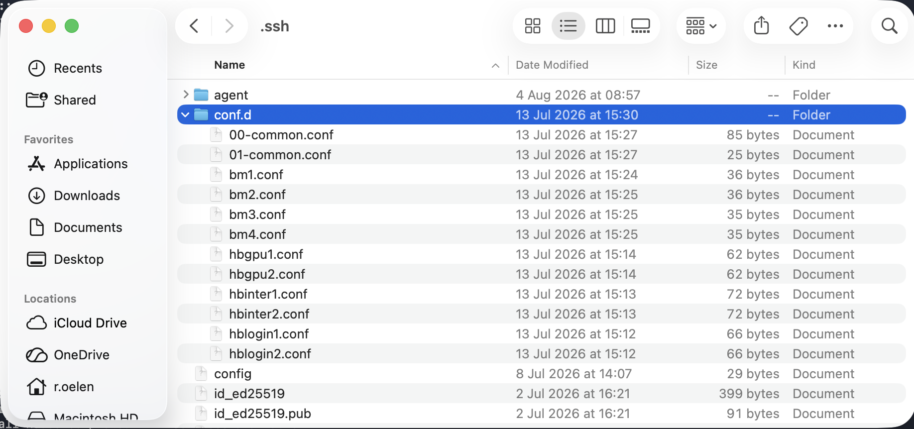
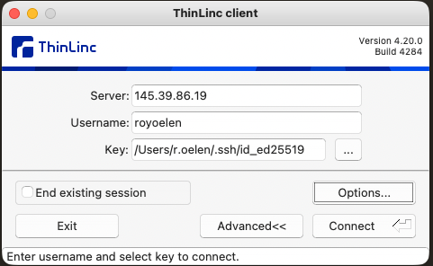

Big Machines (BMs)
==================

The Big Machines (BMs) are a set of four machines, available to Computational Oncology group within the UMCG, meant for heavy calculations. 

.. _access:
Getting access to the BMs
------------------------------------

Access to the BMs is through a secure connection within the UMCG network, making use of private/public keys for authentication. To get access, you first need to create private/public SSH key if you have not done so before. You can find documentaion on how this exactly works `here <https://docs.github.com/en/authentication/connecting-to-github-with-ssh/generating-a-new-ssh-key-and-adding-it-to-the-ssh-agent>`_.
In short, you can create an SSH key like this:

.. code-block:: bash

    ssh-keygen -t ed25519 -C "yourusername"

Saving it in the default location is completely fine. Make note of the filename of the generated keyfile.

By default, the key is saved in the .ssh folder. On Mac or Linux, you need to enable showing hidden files/folders to be able to find the file. There should be at least two files generated. The keyfile name and the keyfile name with .pub appended to the end. 
The .pub file is the public part of your key, that you can share to be granted access to machines. The other file is your private key, and you should never share with anyone. Send the PUBLIC part of your key to the administrator, so you can be granted access to the BMs.

In addition to the key, you also need to have the Global Secure Access Client application active to connect to the BMs. You can download this application `here <https://drive.google.com/file/d/1eAWGDCP_e9cTV2sRCwmx-YlTFp_NOFYn/view?usp=sharing>`_. Unzip the file and install the file for Windows or Mac OS.

.. _connect_cli:
Connecting to the BMs using command line SSH
--------------------------------------------

To connect to the BMs on the command line, or to use port forwarding to the BMs, you need to have set up your .ssh config correctly. On Mac/Linux/WSL, you can make use of this `zip <https://drive.google.com/file/d/1QeKTN3RGofhzrUYNcPYuqHXw_RpHOaRt/view?usp=drive_link>`_. Unzip it and put the CONTENTS into the .ssh folder in your home directory.

Your folder should en up looking like this:

This will then allow you to use the aliases bm1, bm2, bm3 and bm4 for logging in like:

.. code-block:: bash

    ssh bm1

.. _connect_gui:
Connecting to the BMs using a graphical interface
-------------------------------------------------

To connect to the BMs using a graphical user interface, you need to use the ThinLinc client application. You can download this `here <https://www.cendio.com/thinlinc/download/thinlinc-client-archive/>`_, or on Mac OS you can use `brew <https://formulae.brew.sh/cask/thinlinc-client>`_ to install it.

After installing, open the application. Select Advanced. Use the username that the administrator gave you and make the Key point to the private SSH key. The server needs be the IP address of the specific machine you want to connect to, which you can find further down the page.

.. _machines:
BM information
--------------------------------------------

These are the specifications of the different BMs

+---------+---------------+-----------------------------------+-------+-----------------------------------------+
| Machine | IP            | CPU                               | RAM   | GPUs                                    |
+=========+===============+===================================+=======+=========================================+
| BM1     |  145.39.86.19 | Intel Xeon 8160                   |  754G | 2 x NVIDIA Quadro RTX 8000 50GB         |
+---------+---------------+-----------------------------------+-------+-----------------------------------------+
| BM2     |  145.39.86.26 | Intel Xeon Gold 6258R             | 1024G | 2 x NVIDIA Quadro RTX 8000 50GB         |
+---------+---------------+-----------------------------------+-------+-----------------------------------------+
| BM3     |  145.39.86.23 | Intel Xeon Platinum 8380          | 2048G | 2 x NVIDIA RTX 6000 Ada 50GB            |
+---------+---------------+-----------------------------------+-------+-----------------------------------------+
| BM4     |  145.39.86.15 | AMD Ryzen Threadripper PRO 7985WX |  500G | 2 x NVIDIA RTX PRO 6000 Blackwell 100GB |
+---------+---------------+-----------------------------------+-------+-----------------------------------------+

.. _considerations:
Considerations
--------------------------------------------

The BMs are shared among the users in the Computational Oncology group. They are not managed by any job schedulers like SLURM. This gives more flexibility and potentially reduces overhead, but does give the users more responsibility. There are some important considerations to keep in mind:

- do not fill the storage drives to capacity, this will cause the system to become unresponsive and eventually crash
- do not use applications that can change the network status or routing of the machine (such as possible in Docker compose). This will mess up ssh routing and make the machines unreachable.
- communicate with your colleagues that your are using resources on these machines, so they know what is available and what is not.
- try to estimate the amount of resources you will consume, and the amount of resources still available on the machine, to not crash process already running on the machine.
- due to an inpending grant deadline, it might be that one of your colleagues has taken up a majority of the resources on the big machines. Please be understanding of these situations, while also taking into consideration what would be fair use.
- only run work-related tasks on these machine unless you were granted permissions to do so. (No running your own Minecraft server or mining Bitcoins)
