RUG HPC Habrok
==============

Habrok is the university High Performance Cluster (HPC). This cluster is set up to crunch many jobs, and is shared amoung RUG employees and students. It is meant for running your extensive pipelines that 

This cluster has its own documentation, so for details, please refer to that `page <https://www.rug.nl/society-business/center-for-information-technology/research/services/hpc/habrok>`_

.. _access:
Getting access to Habrok
------------------------------------

To get access to Habrok, you need an S-number (student) or P-number (staff). When you get your UMCG account, you should also receive an email that tells you instructions on how to activate your RUG account (which has your s/p-number).
Next, you can request a Habrok account `here <https://wiki.hpc.rug.nl/habrok/introduction/policies#getting_access>`_. 

.. _logging_in:
Logging into to Habrok
------------------------------------

There are a number of machines that can be logged into on Habrok. Again, for details go `here <https://wiki.hpc.rug.nl/habrok/connecting_to_the_system/connecting>`_. In short: 

- There are two login nodes where you can check your folders/files, as well as start jobs. The login nodes will quickly kill any process that is trying to use too much memory, and are NOT meant for calculations.
- There are also two interactive nodes which allow using more memory to test and develop your software/pipelines. They will however kill any processes that uses resources for an extended amount of time, and are thus NOT meant to run your full pipeline or full computation.
- There are finally two interactive GPU nodes, that allow you to test GPU-accelerated software/pipelines. Again, these will kill any processes that uses resources for an extended amount of time, and are thus NOT meant to run your full pipeline or full computation.

For long-running computations and pipelines, always request resources. Only use the interactive (GPU) nodes for testing and development.

To prevent having to memorize all the URLs for all nodes on Mac/Linux/WSL, you can make use of this `zip <https://drive.google.com/file/d/1QeKTN3RGofhzrUYNcPYuqHXw_RpHOaRt/view?usp=drive_link>`_. Unzip it and put the CONTENTS into the .ssh folder in your home directory. Then update the conf.d/01-common.conf file with a text editor to have your p/s number under User.
This will then allow you to use the aliases hblogin1, hblogin2, hbinter1, hbinter2, hbgpu1 and hbgpu2 for logging in like:

.. code-block:: bash

    ssh hblogin1

.. _data:
Data on Habrok
------------------------------------

The Computational Oncology Group in the UMCG uses the hb-computational-oncology and hb-bioinfo-fehrmann groups. If you don't have access to these yet, please email your supervisor.

.. _jupyter_lab:
Using Jupyter Lab on Habrok
------------------------------------

It is possible to use Jupyter Lab on Habrok via the portal. It is however also possible to set a server up yourself, so you can also connect to it via Visual Studio Code. 

Log in to one of the login nodes (hblogin1, hblogin2, etc.)

.. code-block:: bash

    ssh hblogin1

Then open a screen session when logged into one of the nodes (hblogin1, hblogin2, etc.):

.. code-block:: bash

    screen -S jupyter_lab

A screen session will open. We will use this screen session, so that we can easily return to it later. Next, request an interactive session like this:

.. code-block:: bash

    srun --cpus-per-task=4 --mem=64gb --nodes=1 --job-name=jupyter --time=23:59:59 --tmp=1000gb --gpus-per-node=1 --pty bash -i

Modify this to your needs. In my example I request a GPU in addition to memory and CPU.

Generally, using a separate environment for a specific pipeline or task is a good idea. In my case I will use Mamba. Create and activate a new environment like this:

.. code-block:: bash

    mamba create -n gpu_env python=3.14
    mamba activate gpu_env
    mamba install pip

I will then install my required libraries, and jupyter lab itself:

.. code-block:: bash

    pip install matplotlib pandas numpy scikit-learn seaborn qrpca fastica_torch cupy-cuda13x 
    pip install jupyterlab ipykernel

If returning to this environment later, you do not need to install the libraries again, just activate the environment.

.. code-block:: bash

    mamba activate gpu_env

Next we will start the jupyter lab server. We will specify the port, this port should be unique to the node.

.. code-block:: bash

    jupyter lab --port=8811 --no-browser

Now we'll need two things. We need the token that is specified in the output of the command, and the node on which the server is running. The node is specified after your username. If you do not see this information, you can press CRTL+C, and then choose not to kill the session to get the token. In this example:

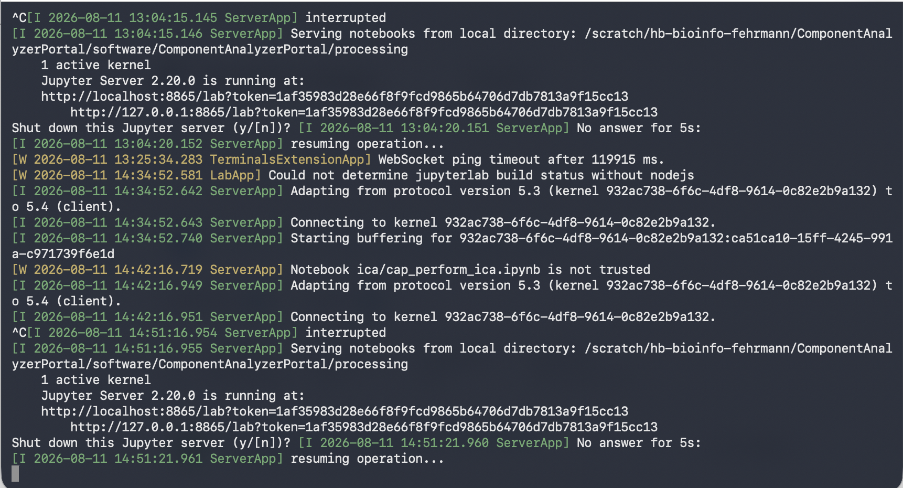

The token is **1af35983d28e66f8f9fcd9865b64706d7db7813a9f15cc13**

To continue on, we need to leave the screen session for a moment. To do this, press CRTL+A, then D. This will detach the screen session. (don't worry if you did not get the node yet, I'll show you in a moment)

If you did not get the node yet, you can find your currently running jobs with the command:

.. code-block:: bash

    squeue -u $USER

Here, you should see the interactive job you just started. The node is specified in the column NODELIST. It is for example **a100gpu2**.

Now we have both the token the node, and the port we selected. We will now forward that port on the node where originally connected to (hblogin1, hblogin2, etc.). While still on that node, we will do this with the following command:

.. code-block:: bash

    ssh -N -f -L localhost:8811:localhost:8811 a100gpu2

In this example, see what we filled in the port and the node our interactive job is running on. In this example it makes it so that on hblogin1, port 8811 points to the same port on the node a100gpu2.

Finally, we need to also do this forward on our local machine. Here we will forward a local port to the node we logged into (hblogin1, hblogin2, etc.). Go to a local terminal (so not on Habrok) and do this:

.. code-block:: bash

    ssh -N -f -L localhost:8811:localhost:8811 hblogin1

Now, we can use jupyter lab in the browser, by going to that port in your browser. 

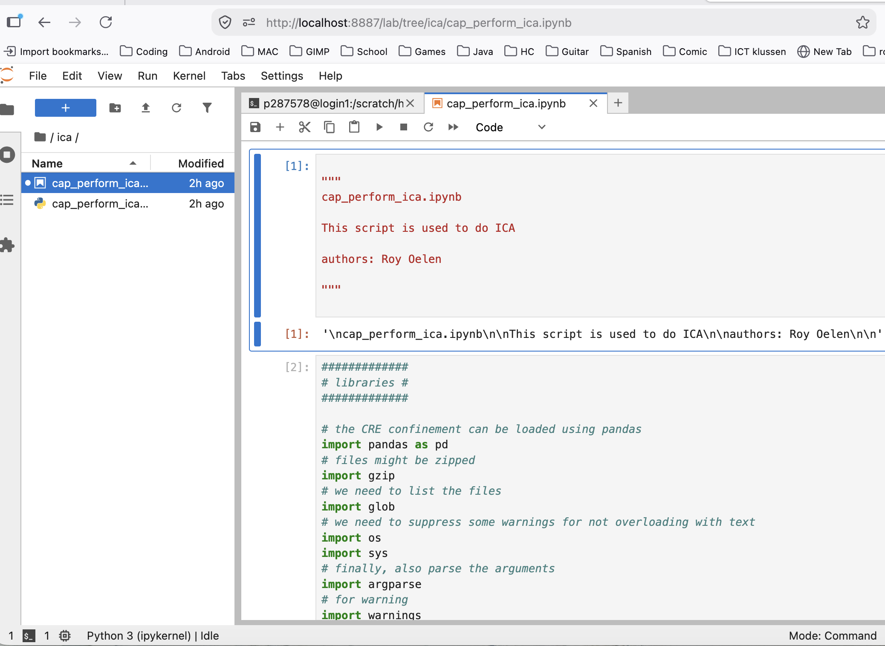

If instead you want to use Visual Studio Code, first install `Remote SSH extension <https://marketplace.visualstudio.com/items?itemName=ms-vscode-remote.remote-ssh>`_

In VSCode, click the search bar:

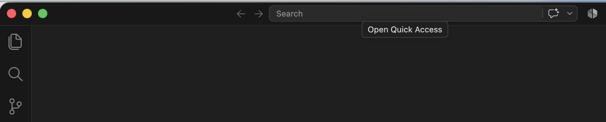

Then select 'Show and Run commands'

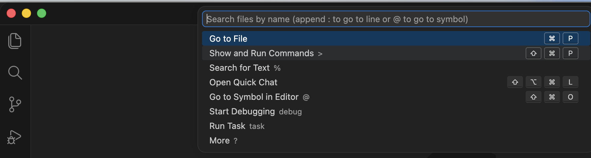

And select 'Remote-SSH: Connect to Host...' (start typing 'Remote-SSH' to find it faster)

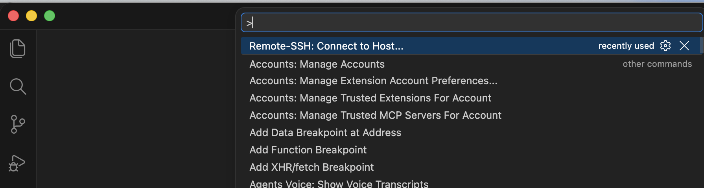

Select the node that you forwarded to (hblogin1, hblogin2, etc.) and click connect.

It might take a while to connect. If you have trouble connecting, try to connect once via the terminal first, and then try again in VSCode.

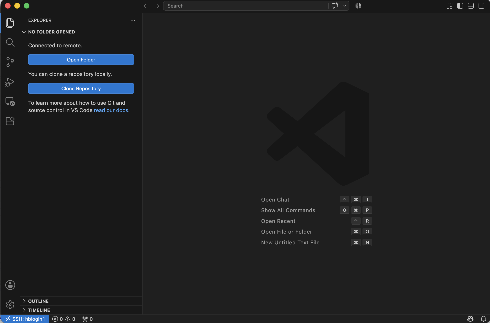

Open a folder, or a file, and select a jupyter notebook file. Or create a jupyter notebook file.

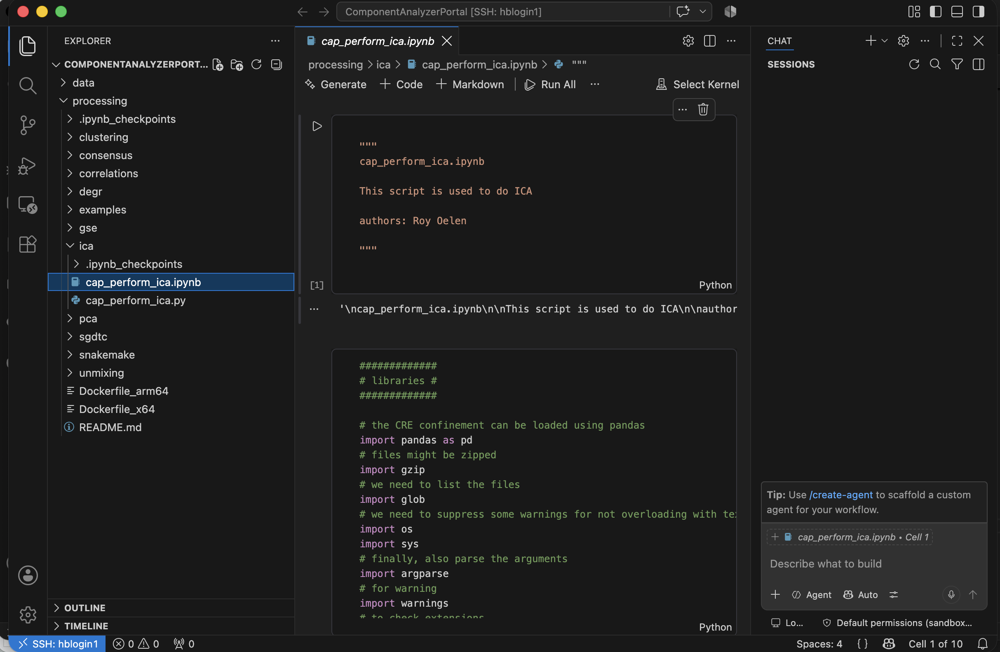

Then, click 'Select Kernel'.

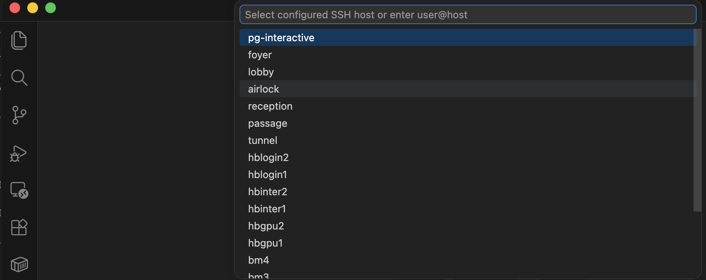

Select 'Existing Jupyter Server' (if you do not see this option, make sure you have the Jupyter extension installed in VSCode)

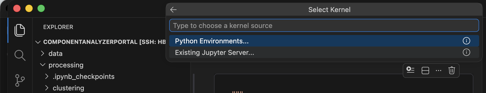

Then, select 'Enter the URL of the running Jupyter server'

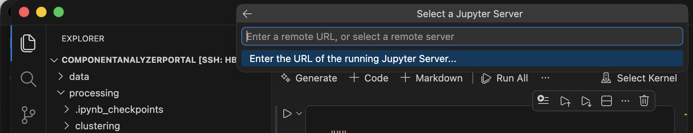

The URL you will need to add is 

- localhost
- the port you selected
- the token you got from the jupyter lab output

pasted together like this: **http://localhost:8865/lab?token=1af35983d28e66f8f9fcd9865b64706d7db7813a9f15cc13**

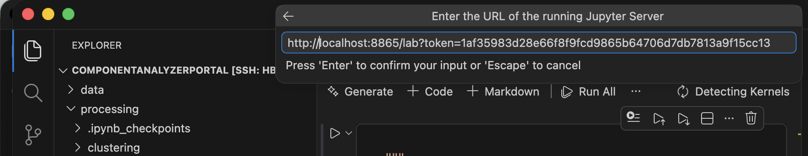

When asked for a name, just make it blank. Now you can choose the kernel. If you have an existing notebook kernel already running, you can connect to that one. You can also start a new one.

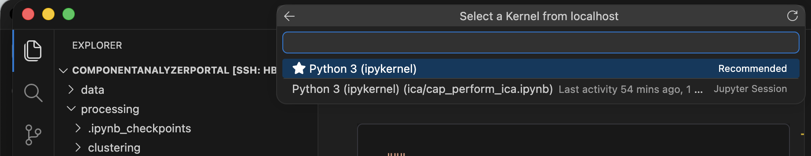
   

Now you can use Jupyter Lab in VSCode, while the computations are running on Habrok.

To stop an interactive session, and thus the jupyter lab server, first see which screen sessions are running. On the node you logged into (hblogin1, hblogin2, etc.) do this:

.. code-block:: bash

    screen -ls

This will show you the screen sessions that are running. You can then re-attach to the screen by its name or ID:

.. code-block:: bash

    screen -r jupyter_lab

Kill the jupyter lab server with CTRL+C, then select 'y' to confirm stopping it. Then type 'exit' to exit the interactive session. Then type 'exit' again to exit the screen session.

.. _rstudio_server:
Using RStudio Server on Habrok
------------------------------------

Rstudio is available via the portal on Habrok, however an Rstudio-server image is available as well, with more preloaded libraries, and can be updated more easily by contacting the maintainer.

Log in to one of the login nodes (hblogin1, hblogin2, etc.)

.. code-block:: bash

    ssh hblogin1

Then open a screen session when logged into one of the nodes (hblogin1, hblogin2, etc.):

.. code-block:: bash

    screen -S rstudio_server

A screen session will open. We will use this screen session, so that we can easily return to it later. Next, request an interactive session like this:

.. code-block:: bash

    srun --cpus-per-task=4 --mem=64gb --nodes=1 --job-name=rstudio --time=23:59:59 --tmp=1000gb --pty bash -i

Modify this to your needs.

Next, we can try to start Rstudio server. There is a small shell script available to do this.

.. code-block:: bash

    /scratch/hb-bioinfo-fehrmann/software/rstudio-server/start_server.sh

If you are running this the first time, it will tell you that you have not selected a port to run on yet. It will tell you to which file to add the port.

.. code-block:: text

    no port selected in /home3/p1234567/SingularityImages/rstudio_server/etc/rserver.conf, add 'www-port=[portnr]' as for example 'www-port=8701' by selecting an available port

Choose a port that is not in use. If you try to run with a port that is already in use, it will error when you try to start the server. You can then change the port. Use nano to add the port (use your own file it showed you a moment ago).

.. code-block:: bash

    nano /home3/p1234567/SingularityImages/rstudio_server/etc/rserver.conf

And add **www-port=8701** with your actual port number. Then save and exit (CTRL+O, ENTER, CTRL+X). Now you can start the server again:

.. code-block:: bash

    /scratch/hb-bioinfo-fehrmann/software/rstudio-server/start_server.sh

The message it should now be giving you is:

.. code-block:: text

    TTY detected. Printing informational message about logging configuration. Logging configuration loaded from '/etc/rstudio/logging.conf'. Logging to '/home3/p1234567/.local/share/rstudio/log/rserver.log'.

Now check what node your interactive job is running on. The node is specified after your username. If you do not see it, you can also get it in the next step.

To continue on, we need to leave the screen session for a moment. To do this, press CRTL+A, then D. This will detach the screen session. (don't worry if you did not get the node yet, I'll show you in a moment)

.. code-block:: bash

    squeue -u $USER

Here, you should see the interactive job you just started. The node is specified in the column NODELIST. It is for example **a100gpu2**.

Now we have both the token the node, and the port we selected. We will now forward that port on the node where originally connected to (hblogin1, hblogin2, etc.). While still on that node, we will do this with the following command:

.. code-block:: bash

    ssh -N -f -L localhost:8701:localhost:8701 a100gpu2

Update the port and node in that example to your own.

Finally, we need to also do this forward on our local machine. Here we will forward a local port to the node we logged into (hblogin1, hblogin2, etc.). Go to a local terminal (so not on Habrok) and do this:

.. code-block:: bash

    ssh -N -f -L localhost:8701:localhost:8701 hblogin1

Now, we can use RStudio Server in the browser, by going to that port in your browser.

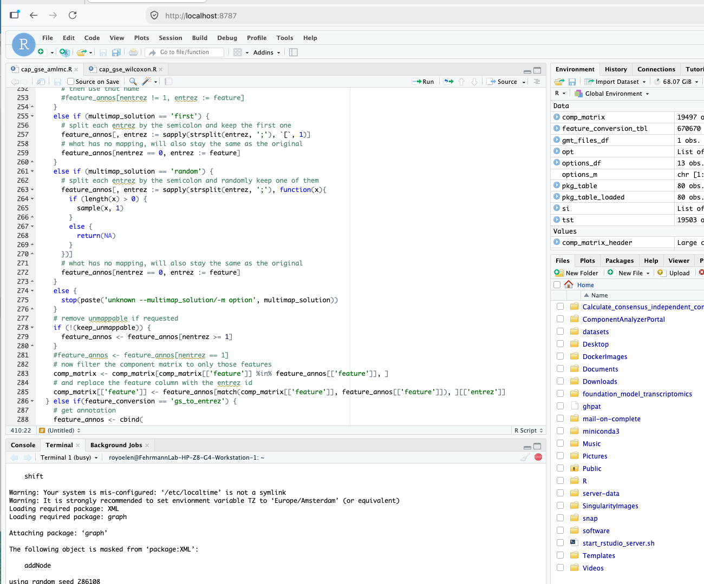

To stop an interactive session, and thus the rstudio server, first see which screen sessions are running. On the node you logged into (hblogin1, hblogin2, etc.) do this:

.. code-block:: bash

    screen -ls

This will show you the screen sessions that are running. You can then re-attach to the screen by its name or ID:

.. code-block:: bash

    screen -r rstudio_server

Kill the rstudio server with CTRL+C. Then type 'exit' to exit the interactive session. Then type 'exit' again to exit the screen session.
