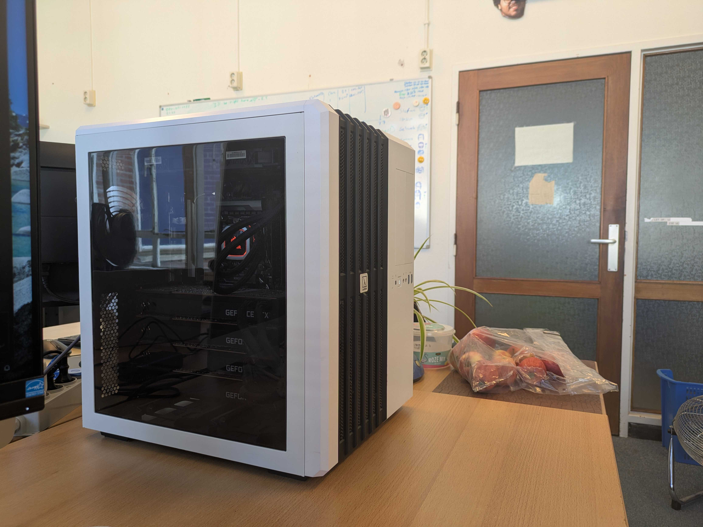
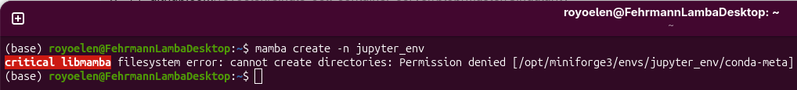
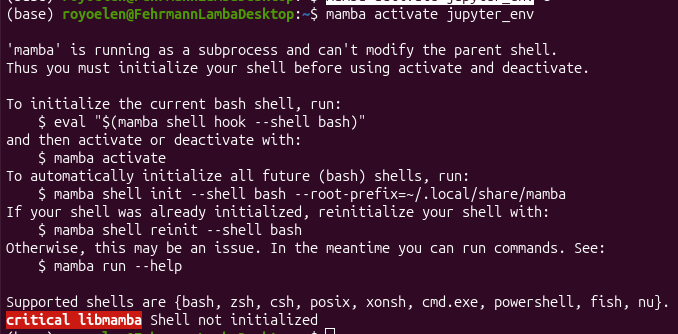
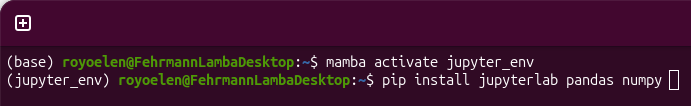
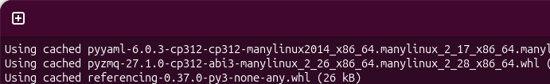
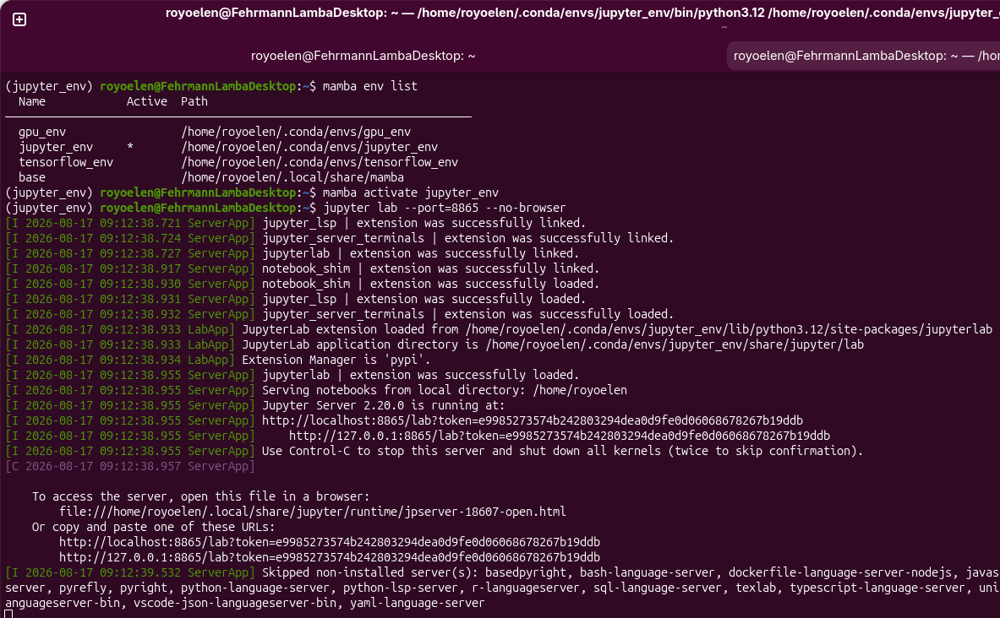
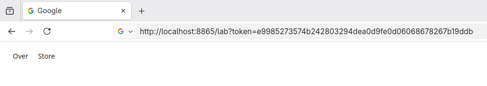
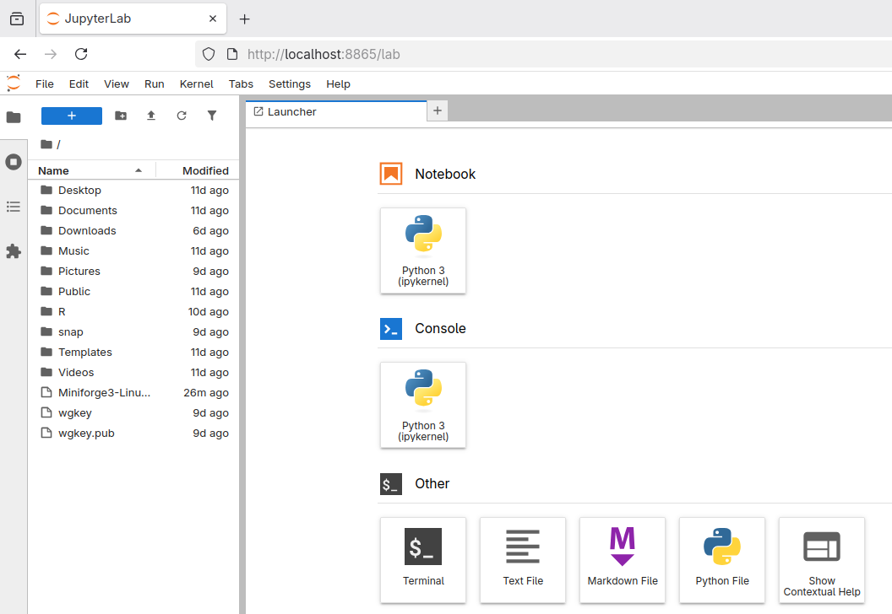
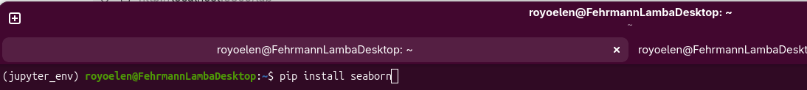
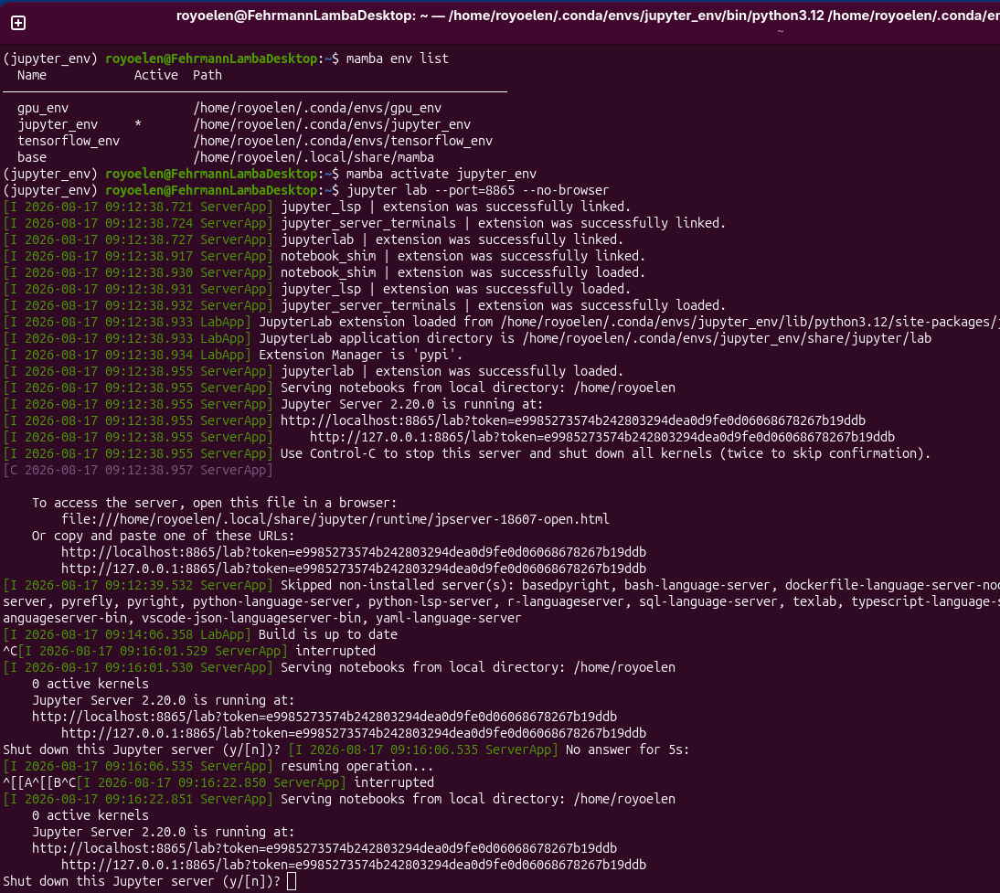

Lamba local machine
===================

The Lamba machine is a small machine available in the Computational Oncology Group within the UMCG, meant for lighter calculations and development.
The machine is located in office G1.20 at the Triade building

.. _access:
Getting access to the Lambda machine
------------------------------------

Access to the Lambda machine is currently managed by Roy Oelen. Contact him to have an account created on this machine. Once he has created the account, you will be prompted to make a password upon first login.

.. _software:
Software on the Lambda machine
------------------------------------

The lamba machine has the basic data science software such as R/Python/Conda installed. If you need additional software or libraries, request these to be installed by one of the administrators. 

.. _working:
Working on the Lambda machine
------------------------------------

The machine is outfitted with four Nvidia RTX 2080TI GPUs, 64GB of RAM and a 20-core Intel i9-9820X and runs on Ubuntu 26.04 LTS. This allows the machine to handle quite some compute, but not at the level of the Habrok clusters or the Big Machines. It is therefore mainly meant to be used as a machine to develop and test on, not to run long and heavy analyses.

Storage is somewhat limited with only a PCIe 3.0 2TB SSD. To prevent unnecessary copies of the same data, there is shared storage under /home/shared. Please create projects and datasets in the correct folders there.

.. _jupyter_lab:
Using Jupyter Lab on Lambda
------------------------------------

You can use Jupyter notebooks on the Lambda machine, much like you could use it on any other desktop. The recommended way to do this however, is to familiarize yourself with Mamba, to make separate environments with the software you need.

First, you can check which environments are available already (should be none if this is your first time doing this)

Open a terminal and do:

.. code-block:: bash

    mamba env list

If you have no environment yet, let's create one

.. code-block:: bash

    mamba create -n jupyter_env python=3.12

If you get an error like this:

You need to create settings file for mamba. Paste this into your terminal:

.. code-block:: bash

    nano ~/.condarc

Then paste into that file:

.. code-block:: text

    envs_dirs:
      - ~/.conda/envs
    pkgs_dirs:
      - ~/.conda/pkgs
    channels:
      - conda-forge
    channel_priority: strict

Then CTRL+O and CTRL+X.
Next try again with:

.. code-block:: bash

    mamba create -n jupyter_env python=3.12

Now try to activate the environment:

.. code-block:: bash

    mamba activate jupyter_env

If you get this error:

Paste this into your terminal:

.. code-block:: bash

    mamba shell init --shell bash --root-prefix=~/.local/share/mamba

Now close the terminal and open a new terminal. Try to activate the environment again:

.. code-block:: bash

    mamba activate jupyter_env

You should see the name of the environment before your username in the terminal now:

Then, try to install some packages into that environment:

.. code-block:: bash

    pip install jupyterlab pandas numpy

Use the '+' button to open another terminal tab

In that new terminal, we'll activate the environment again, and start the jupyter server:

.. code-block:: bash

    mamba activate jupyter_env
    jupyter lab --port=8812 --no-browser

That should start the server. You should see a URL in the output:

Copy that URL into the browser:

Then that should open jupyter lab

Now if you are missing any libraries, you can go back to the terminal that is not running jupyter, and install via pip:

When you are done with the server, go back to the terminal where the server is running, and press CTRL+C, then 'y' to confirm

.. _rstudio_server:
Using RStudio Server on Lambda
------------------------------------

.. _known_issues:
Known issues
------------------------------------

There are some small issues with the machine that we are aware of

- the front USB ports can give overcurrent warnings. Please use the back USB ports.
- openBLAS is used instead of Intel MKL. Linking the superior Intel MKL is currently broken and the (still good but not as good) OpenBLAS implementation is used instead.

Please let the administrators know if you run into any more issues.
